<p align="center">
  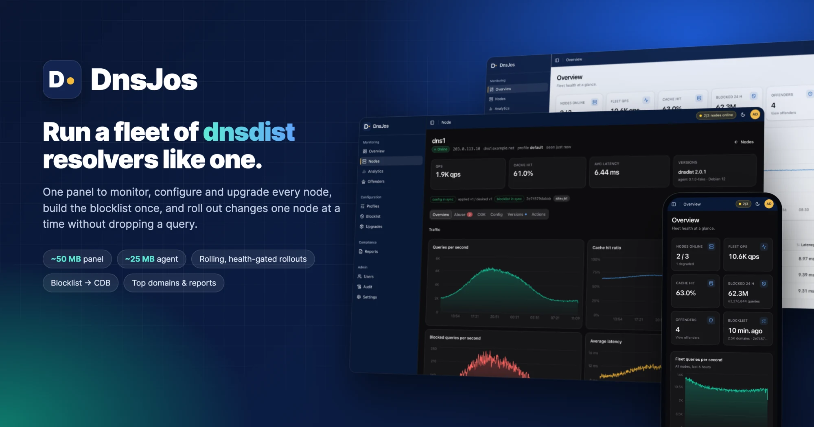
</p>

<p align="center">
  <b>A small, fast control panel for fleets of <a href="https://dnsdist.org">dnsdist</a> resolvers.</b><br>
  Monitor every node, change config safely, build the blocklist once, and report on what was blocked.
</p>

<p align="center">
  
  
  
  
  
  
</p>

<p align="center">
  <a href="#-highlights">Highlights</a> ·
  <a href="#-tour">Tour</a> ·
  <a href="#-how-it-works">How it works</a> ·
  <a href="#-quick-start">Quick start</a> ·
  <a href="#-deploy">Deploy</a> ·
  <a href="docs/OPERATIONS.md">Operations</a> ·
  <a href="docs/SPEC.md">Spec</a>
</p>

---

## Why DnsJos

Running more than one dnsdist server usually means copy-pasted Lua, cron jobs that
download a blocklist on every box, and SSH sessions to find out which node is unhealthy.
DnsJos replaces all of that with **one panel** and **one small agent per node**:

- **The panel** holds the desired config, builds the blocklist, stores metrics and serves the UI.
- **The agent** pulls its config, renders `dnsdist.conf`, checks it with dnsdist, applies it
  and rolls back if dnsdist does not come back.

The panel never connects to a node. Nodes only need outbound HTTPS to the panel.

## ✨ Highlights

<table>
<tr>
<td width="50%" valign="top">

### 🛰️ Fleet monitoring
Queries per second, cache hit ratio, latency, blocked queries and upstream health for
every node, live and over time. Abusive clients and dynamic blocks show up per node.

</td>
<td width="50%" valign="top">

### 🧩 Versioned config with a safety net
Profiles are versioned. You can diff and preview the rendered Lua, and override
settings per node. Every change is checked with `dnsdist --check-config` on the node,
and dnsdist is rolled back if it does not come back.

</td>
</tr>
<tr>
<td valign="top">

### 🚦 One node at a time
Publish a profile change, a dnsdist upgrade or an agent upgrade **node by node,
least busy first**. The next node starts only after the previous one is online,
healthy and back to its traffic. A failure pauses the rollout and returns that node
to its previous version.

</td>
<td valign="top">

### 🧱 Blocklist built once
The panel downloads TrustPositif and your own lists in parallel (byte ranges over
several connections). It merges them into one **CDB** file, and every node downloads
that finished file, checksum-verified. The allowlist unblocks a wrongly listed CDN
within ~15 s, with no restart.

</td>
</tr>
<tr>
<td valign="top">

### ⚖️ Smarter resolving
- **`whashedLatency`**: a lock-free Lua FFI policy. The same name goes to the same
  upstream, but a slow upstream automatically gets fewer names.
- **Serve-stale** keeps answering from cache, for up to an hour, when every upstream is down.
- **CGK steering** points Cloudflare answers at edges that are fast from your network.

</td>
<td valign="top">

### 📊 Analytics & compliance
Top queried domains (raw or grouped by registered domain), NXDOMAIN/SERVFAIL names
and the query-type mix, with no client addresses stored. Yearly blocked-query
reports per node and top blocked domains, exportable as CSV.

</td>
</tr>
<tr>
<td valign="top">

### 🔐 Secure by default
- Sessions with CSRF protection and roles (admin/viewer).
- Read-only API tokens for tools like Grafana.
- dnsdist webserver credentials stored hashed.
- Every change is audit-logged.

</td>
<td valign="top">

### 🪶 Small and self-contained
- The panel is one static Go binary with the UI and the agent builds embedded; it runs at ~50 MB.
- The agent is a static 10 MB binary that runs at ~25 MB.
- The only other dependency is PostgreSQL.

</td>
</tr>
</table>

## 📸 Tour

<p align="center">
  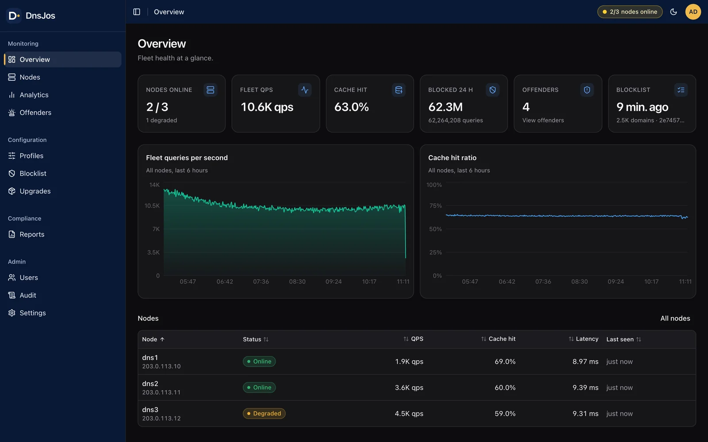
  <br><sub><b>Overview</b>: fleet health, traffic and cache hit ratio at a glance.</sub>
</p>

<table>
<tr>
<td width="50%">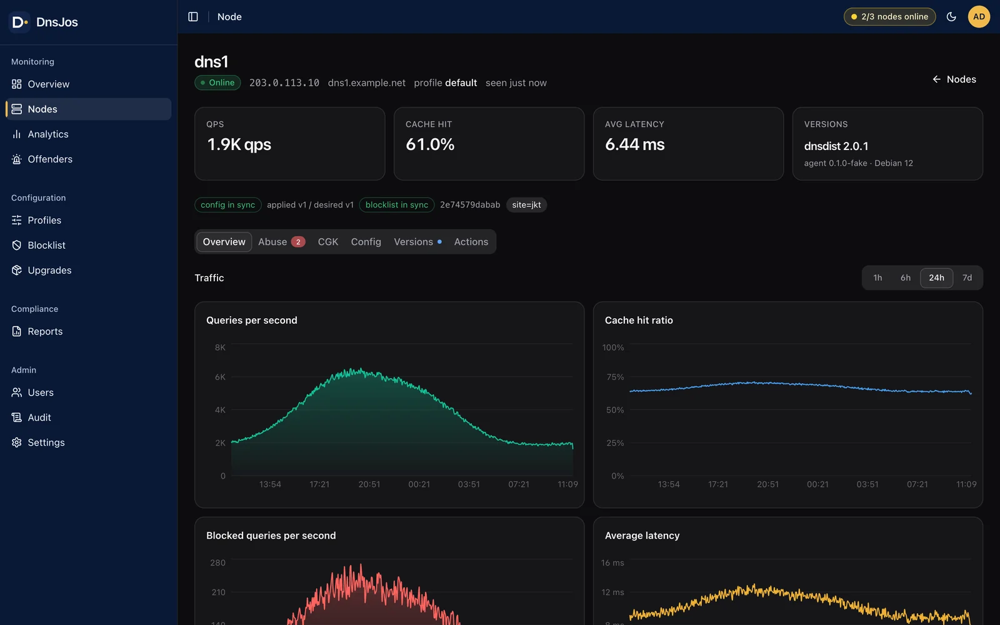<br><sub><b>Node detail</b>: per-node traffic, sync state, abuse, CGK, versions and actions.</sub></td>
<td width="50%">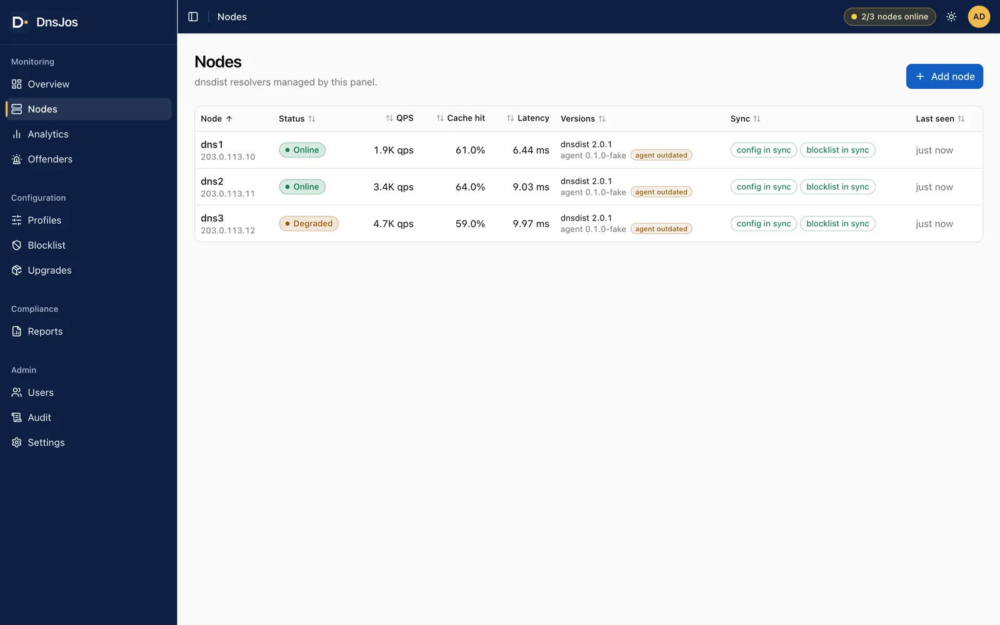<br><sub><b>Nodes</b>: status, load, latency, versions, and config/blocklist sync.</sub></td>
</tr>
<tr>
<td>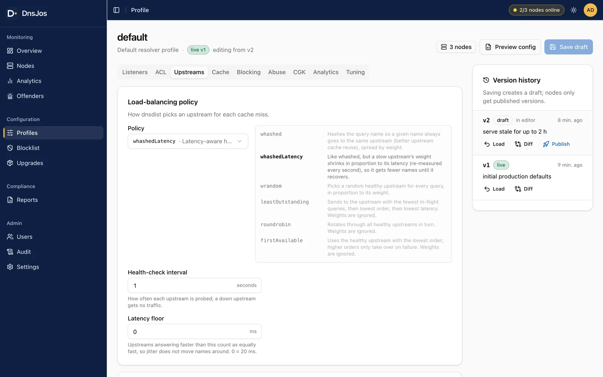<br><sub><b>Profiles</b>: every dnsdist setting as a form, with version history and one-click publish.</sub></td>
<td>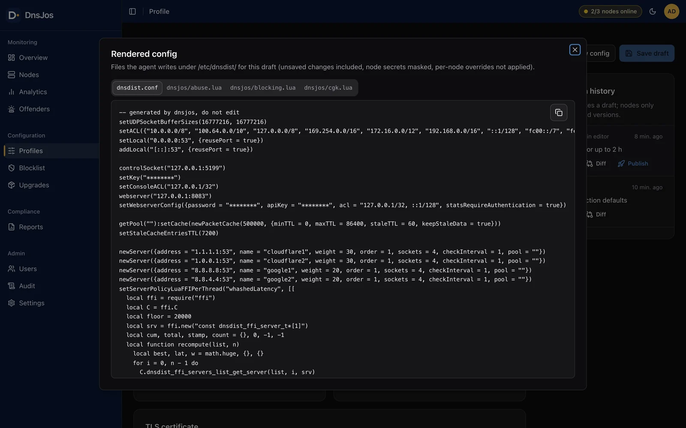<br><sub><b>Preview</b>: the exact Lua each node will run, with secrets masked.</sub></td>
</tr>
<tr>
<td>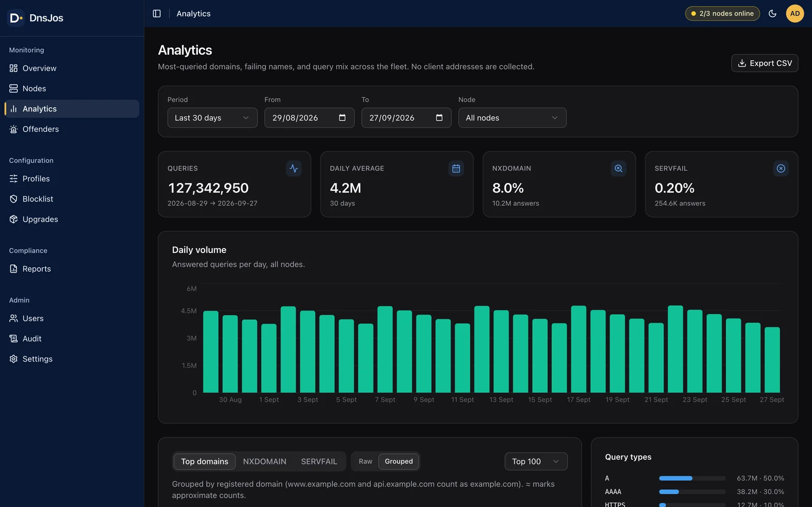<br><sub><b>Analytics</b>: daily volume, top domains, failing names and query types.</sub></td>
<td>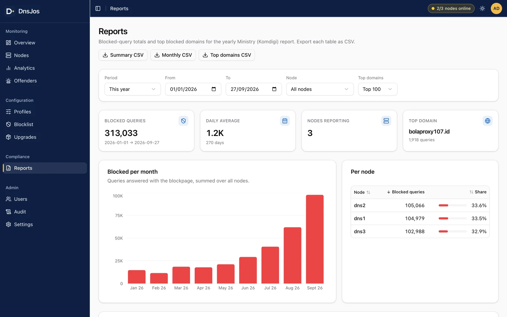<br><sub><b>Reports</b>: blocked queries per month and per node, and top blocked domains, as CSV.</sub></td>
</tr>
<tr>
<td>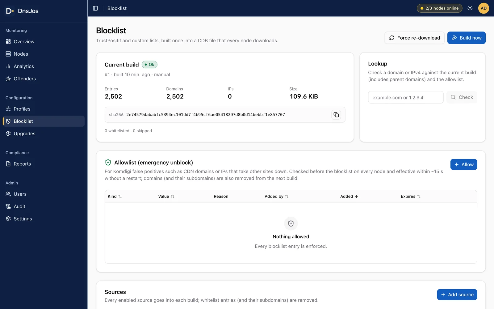<br><sub><b>Blocklist</b>: builds, lookup and the emergency allowlist.</sub></td>
<td>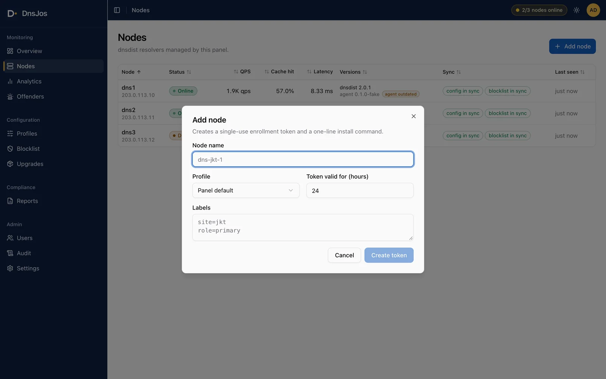<br><sub><b>Add node</b>: a single-use token and a one-line installer.</sub></td>
</tr>
</table>

<p align="center">
  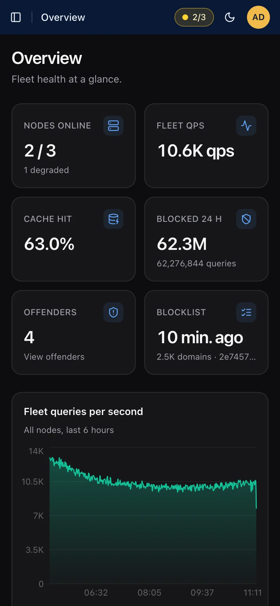
  &nbsp;&nbsp;
  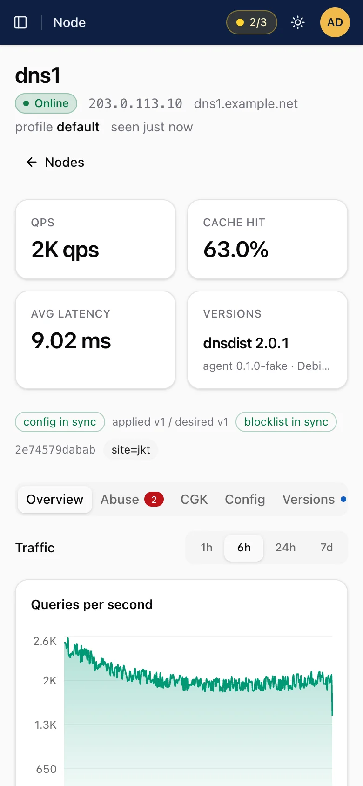
  <br><sub>Responsive, with light and dark themes: usable from a phone at 3 a.m.</sub>
</p>

## 🧠 How it works

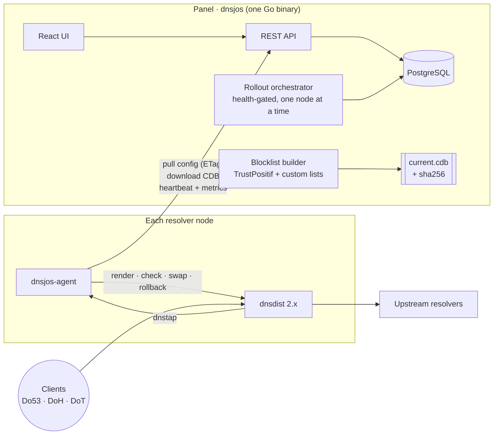

**A config change, end to end:**

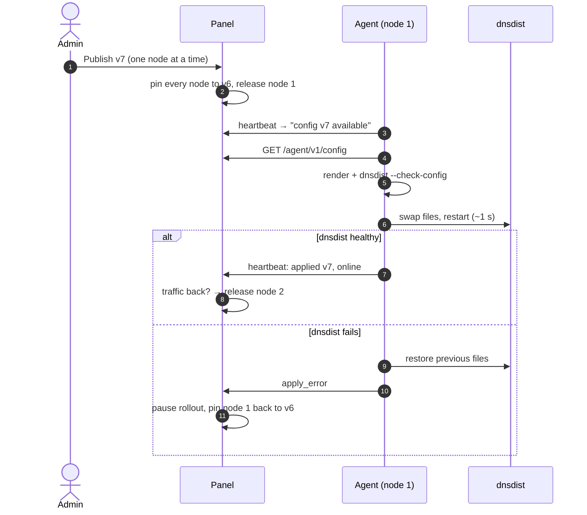

## 📐 By the numbers

| | |
|---|---|
| Panel memory in production | **~50 MB** RSS |
| Agent memory per node | **22–29 MB** RSS |
| Agent binary | **~10 MB**, static, amd64 + arm64 |
| dnsdist interruption per applied change | **~1 s** on one node at a time |
| Blocklist download, 8 streams vs 1 | **3.0 s vs 7.9 s** median |
| Allowlist entry to every node | **≤ 15 s**, no restart |

## 🚀 Quick start

Requirements: **Go 1.25**, **PostgreSQL ≥ 14**, **pnpm**.

```sh
createdb dnsjos
export DNSJOS_DATABASE_URL="postgres://$USER@127.0.0.1:5432/dnsjos?sslmode=disable"
export DNSJOS_BOOTSTRAP_ADMIN_EMAIL=admin@example.com DNSJOS_BOOTSTRAP_ADMIN_PASSWORD=admin-password
make dev            # panel on :8080 + Vite dev server with /api proxy
```

Migrations run automatically at startup. Create more admins with
`dnsjos admin create --email E --password P [--name N]`.

Want data to look at? This enrolls three fake nodes that send heartbeats, analytics and
blocked-domain history to your local panel:

```sh
go run -tags ui ./test/ui -panel http://127.0.0.1:8080 -email admin@example.com -password admin-password
```

## 🔧 Build

```sh
make web            # web/dist
make agent          # internal/panel/install/bin/dnsjos-agent-linux-{amd64,arm64} (+ .sha256)
make panel          # bin/dnsjos, embeds the UI and agent binaries
make release        # all three
make test           # go test ./... (+ web typecheck/lint); set DNSJOS_TEST_DATABASE_URL for DB tests
make hooks          # pre-commit/pre-push checks that keep deployment data out of git
```

A plain `go build ./...` always works, because placeholders are committed for the embedded assets.

## 🌍 Deploy

1. Create a PostgreSQL database and user `dnsjos`.
2. Copy `bin/dnsjos` to `/usr/local/bin/`, `deploy/dnsjos.env.example` to
   `/etc/dnsjos/dnsjos.env` (edit it) and `deploy/dnsjos.service` to `/etc/systemd/system/`.
   Create the `dnsjos` system user, then run `systemctl enable --now dnsjos`.
3. Put a TLS proxy in front (see [`deploy/Caddyfile.example`](deploy/Caddyfile.example))
   and set `DNSJOS_PUBLIC_URL`.
4. Add a node: **Nodes → Add node** gives you a one-line installer:

   ```sh
   curl -fsSL https://PANEL/install.sh | sudo sh -s -- --token TOKEN
   ```

Already running dnsdist? **Adopt** it instead. The agent imports the existing
secrets, listeners and certificates, and shows you a plan before touching anything.
Adopt one node at a time, so customers keep resolving. See the
[adoption runbook](docs/OPERATIONS.md#adopting-a-live-dnsdist-server-rolling-zero-customer-downtime).

The panel can also carry your own brand (name, logos, login background) without a
rebuild; see `DNSJOS_BRAND_*` in [`deploy/dnsjos.env.example`](deploy/dnsjos.env.example).

## 📚 Documentation

| Document | What's inside |
|---|---|
| [docs/OPERATIONS.md](docs/OPERATIONS.md) | Adding and adopting nodes, publishing changes, emergency unblock, Grafana/read-only API |
| [docs/SPEC.md](docs/SPEC.md) | The full design contract: config schema, renderer, agent protocol, API, rollouts, analytics |

## 🗂️ Layout

```
cmd/dnsjos            panel binary (serve | migrate | admin create | version)
cmd/dnsjos-agent      node agent
internal/panel/…      API, auth, blocklist builder, rollouts, analytics, reports
internal/agent/…      apply + rollback, CDB sync, dnstap, CGK prober, upgrades
internal/shared/…     wire types, dnsdist config renderer, CDB format
web/                  React 19 + Vite + Tailwind v4 + shadcn/ui
migrations/           forward-only SQL, applied at startup
deploy/               systemd units, env example, Caddyfile example
```
